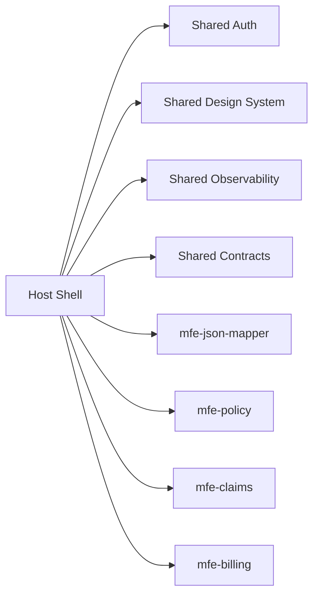

# Arquitetura Alvo da Plataforma de Microfrontends

## Visão

A plataforma deve permitir que múltiplos produtos da Porto Seguro compartilhem:

- identidade visual
- autenticação
- observabilidade
- runtime comum
- contratos públicos

sem compartilhar regras de negócio entre domínios.

## Padrão principal

- Shell/Host + Remotes
- Monorepo com Nx
- Microfront por domínio
- DDD leve
- vertical slices

## Mapa de alto nível



## Responsabilidades do shell

- composição
- autenticação
- autorização
- navegação
- feature flags
- observabilidade
- sessão global
- tema
- fallbacks de carregamento

## Responsabilidades do remote

- regra de negócio do domínio
- estado local do domínio
- telas, fluxo e casos de uso do domínio
- integração com backend do domínio

## Estrutura do monorepo

```text
apps/
  host-shell/
  mfe-json-mapper/
  mfe-policy/
  mfe-claims/
  mfe-billing/
  mfe-admin/

libs/
  shared/
    contracts/
    design-system/
    auth/
    observability/
    runtime/
    util/
```

## Estrutura interna de um remote

```text
features/
  policy-details/
    domain/
    application/
    infra/
    ui/
```

## Boundaries

- `ui` depende de `application`
- `application` depende de `domain`
- `infra` implementa portas usadas por `application`
- `domain` não depende de `ui`
- remotes não importam código uns dos outros

## Contratos públicos

Exemplo de contrato de sessão:

```ts
export interface UserSession {
  userId: string;
  tenantId: string;
  roles: readonly string[];
}
```

Exemplo de contrato de evento:

```ts
export type AppEvent =
  | { type: 'AUTH/SESSION_UPDATED'; payload: UserSession }
  | { type: 'MAPPER/SAVED'; payload: { configId: string } };
```

## Observabilidade

Obrigatório no shell e opcionalmente enriquecido pelos remotes:

- logging
- tracing
- erros
- métricas por domínio

## Regras de reuso

Compartilhar:

- contratos
- design tokens
- componentes básicos
- abstrações de auth
- utilitários estáveis

Não compartilhar cedo:

- stores de negócio
- facades de domínio
- services de domínio
- componentes smart de produto
